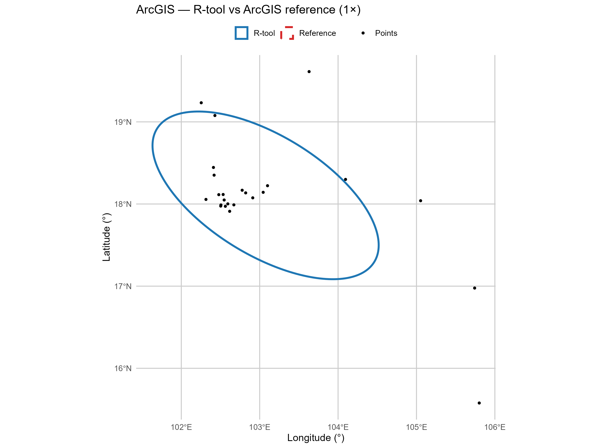

# 📍 Standard Deviational Ellipse (SDE) Tool: SDEtool

[](https://github.com/parker-group/SDEtool/releases/tag/v1.0.0)

[](https://github.com/parker-group/SDEtool/blob/main/LICENSE)

This R tool computes **Standard Deviational Ellipses (SDEs)** for spatial point data grouped by user-defined variables.  
It supports:
- Multiple standard deviation levels (e.g., 1, 2, 3 SD)
- Weighted points (optional)
- Yuill + √2 correction (default)
- Degrees of freedom correction (default)
- Summary of ellipse shape + % of points enclosed
- Comparison of point patterns (i.e. SDEs) across groups
- Settings to mimic ArcGis or CrimeStat, if you prefer their approaches or just want to compare this tool to those tools.

For background, see:  
📚 Reference: Yuill, R. S. (1971). *The Standard Deviational Ellipse: An Updated Tool for Spatial Description*. Geografiska Annaler: Series B, Human Geography, 53(1), 28–39. https://doi.org/10.2307/490885  
📖 [ArcGIS documentation on Standard Deviational Ellipses](https://pro.arcgis.com/en/pro-app/latest/tool-reference/spatial-statistics/h-how-directional-distribution-standard-deviationa.htm)

---

## 📂 Table of Contents

- [Workflow Steps](#-workflow-steps)
- [Simulated Example 1: Latitude/Longitude Data](#-simulated-example-1-latitudelongitude-data)
- [Simulated Example 2: UTM Projected X/Y Data](#-simulated-example-2-utm-projected-xy-data)
- [Simulated Example 3: Latitude/Longitude Data with a count of people/samples from each location, to be used as a weight](#-simulated-example-3-latitudelongitude-data-with-a-count-of-peoplesamples-from-each-location-to-be-used-as-a-weight)
- [Coordinate System Tips](#-coordinate-system-tips)
- [What the SDE computes](#-what-the-sde-computes)
- [Validation](#-validation)
- [Reference PDF](The%20Standard%20Deviational%20Ellipse%20%20An%20Updated%20Tool%20for%20Spatial%20Description.pdf)


---

## 🔧 Workflow Steps

### 1. Load the required functions

You must first load the R functions before any other step will work.

There are **three ways** to do this:

- 🖱️ **Option 1: Copy + paste directly into R**  
  You can literally go to the `SDE_functions.r` script, copy the functions, and paste them into your R console.

- 💻 **Option 2: Source the file locally** (if you've cloned or downloaded this repo)  
```r
source("SDE_functions.r")
```

- 🌐 **Option 3: Source directly from GitHub**  
```r
source("https://raw.githubusercontent.com/parker-group/SDEtool/main/SDE_functions.r")
```

➡️ [**View the full `SDE_functions.r` script on GitHub**](https://github.com/parker-group/SDEtool/blob/main/SDE_functions.r)

---

### 2. Load your data

Your dataset must:
- Include **geographic coordinates**
  - Either longitude/latitude (in degrees), or
  - Projected X/Y values (e.g., UTM in meters)
- Include a **grouping variable** (e.g., Region, Year, or group_var) if you want to compute SDEs for different subsets. If not, you'll need to set this option to "NULL" later.

The tool will automatically try to detect latitude and longitude columns using common names. Specifically, it searches for:
```r
lat_candidates <- c("latitude", "Latitude", "lat", "Lat", "y", "Y")
lon_candidates <- c("longitude", "Longitude", "lon", "Lon", "x", "X")
```

If your coordinate columns don't match these, rename them before running the functions.

If you're grouping by a variable (e.g., region, year, or category), name it or them clearly — e.g., "Region" or "genus" (`group_vars = "Region"`). You can have multiple (`group_vars = c("Region", "genus")`). 

If your data have repeats per location, you can either run the tool with multiple rows having the same location - or - you could generate a dataset that has one row per location and a count of people or samples from each location. Make sure you clearly name that "count" variable as well, and you can use that as a `weight` in the SDE function (`weight_col = count`). 

Example:
```r
df <- data.frame(
  longitude = c(36.8, 36.9, 36.7),
  latitude  = c(-1.3, -1.4, -1.2),
  group_var = c("A", "A", "B")
)
```

---

### 3. Make it spatial (sf) — choose WGS84 or UTM

We need to convert your data to an **sf** object, which stores geometry and CRS metadata. From there you have two paths: **(a) keep WGS84 (EPSG:4326)** to compare durians-to-durians with ArcGIS/CrimeStat and produce ellipses in degrees, or **(b) project to a metric CRS (e.g., UTM)** when you want axis lengths/areas in meters. If your input is lat/lon, `convert_to_sf_utm()` can auto-pick a UTM zone; if your input is already projected (e.g., UTM), specify its EPSG explicitly. Projection doesn’t alter the ellipse’s geometry—just the units and exact ArcGIS/CrimeStat parity.

Convert to an **sf** object, then either keep **WGS84 (degrees)** for ArcGIS/CrimeStat parity, or **project to UTM (meters)** if you want metric axes/areas.

**Option A — keep WGS84 (degrees): best for matching desktop tools**
```r
sf_pts_proj <- convert_to_sf_utm(df, input_crs = 4326, target_epsg = 4326)
# or equivalently:
# pts <- sf::st_as_sf(df, coords = c("longitude", "latitude"), crs = 4326)
```

**Option B — switch to UTM (meters): best when you want metric units**  
*(auto-picks a UTM zone if your input is lat/lon)*
```r
sf_pts_proj <- convert_to_sf_utm(df)
```

**Option C — data already projected (X/Y in meters): you MUST specify both EPSG codes**  
*If your input isn’t lat/lon, the helper can’t guess the CRS—set `input_crs` and `target_epsg`.*
```r
sf_pts_proj <- convert_to_sf_utm(df, input_crs = 32636, target_epsg = 32636)
```

> 💡 **Note (degrees-first path):** For parity with ArcGIS/CrimeStat geometry, pass an EPSG:4326 `sf` to `generate_sde_ellipses()` with `compute_in = "input"` and `output_crs = "input"`. The UTM workflow above is useful when you prefer metric areas/axes by default.

---
### 4. Generate SDEs (modes: arcgis, crimestat, prob)
Use the main function to create ellipses for each group. *Note that you can set the group vars to "NULL" if you want SDEs for all points in the data.*

```r
sde_sf <- generate_sde_ellipses(
  sf_pts_proj,
  group_vars     = "Region",
  sd_levels      = c(1, 2, 3),
  min_points     = 5,
  sqrt2_scaling  = TRUE,
  dof_correction = TRUE,
  weight_col     = NULL,
  mode           = "arcgis",   # "arcgis", "crimestat", or "prob"
  compute_in     = "working",  # if using UTM; set "input" to stay in EPSG:4326
  output_crs     = "working"   # set "input" to keep EPSG:4326 geometry
)
```

- `mode = "arcgis"` → df = n, scale = k·√2, angle basis = north_cw.  
- `mode = "crimestat"` → df = n−2, scale = k·√2, angle basis = north_cw.  
- `mode = "prob"` → coverage targets (MVN) with `scale = sqrt(qchisq(p, df=2))`, `df = n−1`. Use e.g. `coverage = c(0.6827, 0.95, 0.9973)`.

---

### 5. Inspect, summarize, and plot results

Print the results or summarize how many points fall within each SD level:
```r
print(sde_sf)
aggregate(percent_inside ~ sd_level, data = sde_sf, summary)

##plot a map of the data
library(ggplot2)
library(sf)

ggplot() +
  geom_sf(data = sde_sf, aes(fill = as.factor(sd_level)), alpha = 0.3, color = "black") +
  geom_sf(data = sf_pts_proj, aes(color = Region), size = 1.2) +
  scale_fill_brewer(palette = "Set2", name = "SD Level") +
  scale_color_brewer(palette = "Dark2", name = "Region") +
  theme_minimal() +
  labs(
    title = "Standard Deviational Ellipses",
    subtitle = "With Input Points Overlaid",
    x = "Easting (m)", y = "Northing (m)"
  )
```

---

### 6. Export results (shapefile/CRS options)

If desired, export your SDEs to a shapefile:
```r
#this will export a .shp file in the UTMs we are using here. You will need to update the folder location
sf::st_write(sde_sf, "SDE_ellipses.shp", delete_dsn = TRUE)

#this will convert back to WGS84 (normal lat/lon) before you export the .shp file. You will need to update the folder location
sde_wgs84 <- sf::st_transform(sde_sf, crs = 4326)
sf::st_write(sde_wgs84, "SDE_ellipses_WGS84.shp", delete_dsn = TRUE)
```

---

## 🧪 Simulated Example 1: Latitude/Longitude Data

```r
set.seed(123)
n <- 100
df1 <- rbind(
  data.frame(
    Longitude = runif(n / 2, min = 36.6, max = 36.7),
    Latitude = runif(n / 2, min = -1.5, max = -1.4),
    Region = "East"
  ),
  data.frame(
    Longitude = runif(n / 2, min = 36.9, max = 37.0),
    Latitude = runif(n / 2, min = -1.1, max = -1.0),
    Region = "West"
  )
)

#what do my data look like?
head(df1)

#now use the SDE tools
sf_pts_proj <- convert_to_sf_utm(df1)
sde_sf <- generate_sde_ellipses(sf_pts_proj, group_vars = "Region")
print(sde_sf)

##generate a simple map in R
# Load packages
library(ggplot2)
library(sf)

# Plot
ggplot() +
  geom_sf(data = sde_sf, aes(fill = as.factor(sd_level)), alpha = 0.3, color = "black") +
  geom_sf(data = sf_pts_proj, aes(color = Region), size = 1.2) +
  scale_fill_brewer(palette = "Set2", name = "SD Level") +
  scale_color_brewer(palette = "Dark2", name = "Region") +
  theme_minimal() +
  labs(
    title = "Simulated Ellipses from Latitude/Longitude Data",
    subtitle = "Projected to UTM automatically",
    x = "Easting (m)", y = "Northing (m)"
  )
```

---

## 🧪 Simulated Example 2: UTM Projected X/Y Data

```r
set.seed(456)
n <- 100
df2 <- rbind(
  data.frame(
    X = rnorm(n / 2, mean = 490000, sd = 5000),
    Y = rnorm(n / 2, mean = 980000, sd = 5000),
    Region = "North"
  ),
  data.frame(
    X = rnorm(n / 2, mean = 510000, sd = 5000),
    Y = rnorm(n / 2, mean = 1000000, sd = 5000),
    Region = "South"
  )
)

#what do my data look like?
head(df2)

#now use the SDE tools
sf_pts_proj <- convert_to_sf_utm(df2, input_crs = 32636, target_epsg = 32636)
sde_sf <- generate_sde_ellipses(sf_pts_proj, group_vars = "Region")
print(sde_sf)

#generate simple map in R
# Load packages
library(ggplot2)
library(sf)
# Plot
ggplot() +
  geom_sf(data = sde_sf, aes(fill = as.factor(sd_level)), alpha = 0.3, color = "black") +
  geom_sf(data = sf_pts_proj, aes(color = Region), size = 1.2) +
  scale_fill_brewer(palette = "Set2", name = "SD Level") +
  scale_color_brewer(palette = "Dark2", name = "Region") +
  theme_minimal() +
  labs(
    title = "Simulated Ellipses from Projected UTM Coordinates",
    subtitle = "EPSG:32636",
    x = "Easting (m)", y = "Northing (m)"
  )

```

---

## 🧪 Simulated Example 3: Latitude/Longitude Data with a count of people/samples from each location, to be used as a weight
```r
# Simulate spatial points in two regions with distinct geographic clusters
set.seed(789)
n <- 100

# Group "East"
east <- data.frame(
  Longitude = runif(n / 2, min = 36.6, max = 36.75),
  Latitude = runif(n / 2, min = -1.5, max = -1.35),
  Region = "East",
  count = sample(1:10, n / 2, replace = TRUE)
)

# Group "West" farther away
west <- data.frame(
  Longitude = runif(n / 2, min = 36.85, max = 37.0),
  Latitude = runif(n / 2, min = -1.2, max = -1.05),
  Region = "West",
  count = sample(1:10, n / 2, replace = TRUE)
)

# Combine the two
df3 <- rbind(east, west)

# what do my data look like?
head(df3)

# Convert to spatial object with UTM projection
sf_pts_proj <- convert_to_sf_utm(df3)

# Generate weighted SDEs
sde_sf <- generate_sde_ellipses(
  sf_pts_proj,
  group_vars = "Region",
  sd_levels = c(1, 2, 3),
  min_points = 5,
  sqrt2_scaling = TRUE,
  dof_correction = TRUE,
  weight_col = "count"
)

# Inspect output
print(sde_sf)

# Plot SDEs and weighted points
library(ggplot2)
library(sf)

ggplot() +
  geom_sf(data = sde_sf, aes(fill = as.factor(sd_level)),
          alpha = 0.3, color = "black") +
  geom_sf(data = sf_pts_proj, aes(size = count, color = Region),
          alpha = 0.8) +
  scale_size_continuous(range = c(1, 6)) +
  scale_fill_brewer(palette = "Set2", name = "SD Level") +
  scale_color_brewer(palette = "Dark2", name = "Region") +
  theme_minimal() +
  labs(
    title = "Weighted SDEs by Region",
    subtitle = "Point size represents 'count' used as weight",
    x = "Easting", y = "Northing"
  )
```
---

## 🛍 Coordinate System Tips

| Situation                                  | Coordinate Type               | What You Should Do                                           | Example Call                                                                 |
|--------------------------------------------|-------------------------------|--------------------------------------------------------------|-------------------------------------------------------------------------------|
| Coordinates like `-1.3`, `36.8`            | Latitude/Longitude (degrees)  | Use defaults; UTM can be added later if you want meters      | `convert_to_sf_utm(df)`                                                      |
| GPS data from a phone/app                  | Latitude/Longitude (degrees)  | Defaults fine; auto-detect UTM if you want metric units      | `convert_to_sf_utm(my_data)`                                                 |
| X/Y values like `500000`, `1000000` (m)    | Projected (e.g., UTM)         | **Specify** the CRS (EPSG) explicitly                        | `convert_to_sf_utm(df, input_crs = 32632, target_epsg = 32632)`              |
| Not sure what CRS you have                 | Unknown                       | Check in GIS or ask provider                                 | —                                                                             |
| You want desktop parity (ArcGIS/CrimeStat) | Degrees (WGS84)               | Keep geometry in degrees for comparisons                     | pass an EPSG:4326 `sf` to `generate_sde_ellipses(..., compute_in="input", output_crs="input")` |
| You want meters by default                 | UTM (meters)                  | Project to UTM for metric areas/axes                         | `convert_to_sf_utm(df)` or set `working_crs = <EPSG>` in your call            |

**💡 How to Find EPSG Codes:**
- Visit [epsg.io](https://epsg.io)
- Use `sf::st_crs()` on known spatial data
- In QGIS: Right-click layer → Properties → CRS

---

## 🔬 What the SDE computes

The Standard Deviational Ellipse (SDE) summarizes the spatial distribution of points by showing the directional trend and spread.  
Each ellipse covers approximately:
- **~63%** of points at 1 standard deviation
- **~98%** at 2 standard deviations
- **~99.9%** at 3 standard deviations  
Assumes approximately normal distribution in 2D space.

Ellipse orientation is defined by the **eigenvector** of the covariance matrix of X and Y — this shows the direction of greatest spread (i.e., the major axis of the ellipse).

---

## ✅ Validation

We validate SDEtool against **ArcGIS** and **CrimeStat** on the same dataset (Lepto, n = 24, WGS84). We will do some more validations on simulated and other real-world data over time. You can find details here:

➡️ **Full report:** [validation/SDE_validation.md](validation/SDE_validation.md)

**What you’ll see in the report (briefly):**
- **ArcGIS preset (R)** vs **ArcGIS**: near–byte-for-byte geometric parity in degrees.
- **CrimeStat preset (R)** vs **CrimeStat**: very close agreement; small diffs expected from df/export details.
- **Probabilistic (MVN)**: coverage-target ellipses shown for transparency.

**Example overlay (WGS84):** R-tool (blue solid) vs ArcGIS reference (red dashed)




---
### 💡 Motivation

There are several other tools that support Standard Deviational Ellipse (SDE) calculations, including:

- 🧭 **[CrimeStat](https://nij.ojp.gov/library/publications/crimestat-40-user-manual)** – a comprehensive spatial analysis program used widely in criminology and public safety  
- 🛰️ **[ArcGIS SDE Tool](https://pro.arcgis.com/en/pro-app/latest/tool-reference/spatial-statistics/h-how-directional-distribution-standard-deviationa.htm)** – a built-in function in ArcGIS for directional distribution analysis  
- 🧩 **[QGIS SDE Plugin](https://github.com/havatv/qgisstandarddeviationalellipseplugin)** – a community-developed plugin for generating ellipses in QGIS  

These tools are well established and widely used within desktop GIS environments.

This R-based tool was created to provide a fully **open-source**, **script-based**, and **reproducible** alternative tailored for R users. It integrates smoothly into analytical workflows, supports **weighted points**, **custom grouping**, and offers flexible control over ellipse generation — making it especially suitable for transparent and research-grade spatial analyses.  

I developed this tool after encountering limitations with plugin-based approaches and needing a workflow that could be easily validated, customized, and shared in R. Feel free to fork or adapt!
