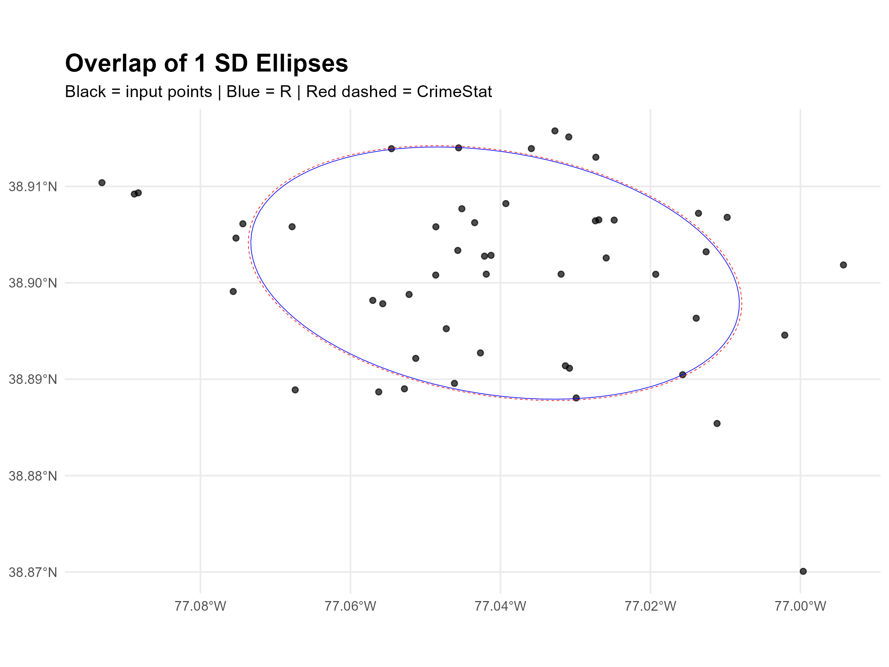
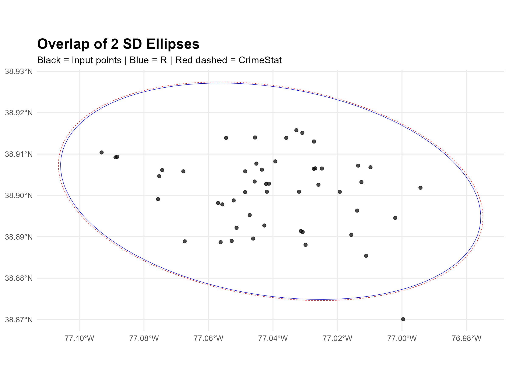

# 🧪 Standard Deviational Ellipse (SDE) Validation

This page documents the validation of an R-based Standard Deviational Ellipse (SDE) tool by comparing its output with ellipses generated by CrimeStat. We tested 1- and 2-standard deviation ellipses generated from the same dataset.

---

## 🔍 Summary of Results

| Metric                | 1 SD Ellipse        | 2 SD Ellipse        |
|-----------------------|---------------------|---------------------|
| **Area (R Tool)**     | 12,506,460 m²       | 50,025,840 m²       |
| **Area (CrimeStat)**  | 12,834,232 m²       | 51,102,470 m²       |
| **IoU**               | 0.979               | 0.979               |
| **Centroid Distance** | 0.139 m             | 0.317 m             |
| **Orientation (R)**   | 169.00°             | 169.00°             |
| **Orientation (CS)**  | 169.00°             | 169.00°             |
| **Angle Difference**  | 0.004°              | 0.004°              |
| **Eccentricity (R)**  | 0.877               | 0.877               |
| **Eccentricity (CS)** | 0.877               | 0.877               |
| **Ecc. Difference**   | 0.000               | 0.000               |

> ℹ️ *Orientation is derived from the first principal component of the polygon coordinates. Eccentricity is calculated as √(1 - b²/a²), where `a` and `b` are the semi-major and semi-minor axes.*

---

## 📐 Methodology

- **R Tool**: Uses PCA (eigen decomposition of the coordinate matrix) to define orientation and shape.
- **CrimeStat**: Uses moment-based orientation derived from dispersion about the mean center.
- All files were projected to **WGS 84 / UTM Zone 18N (EPSG:32618)** prior to comparison.
- Comparison metrics:
  - Area
  - Intersection over Union (IoU)
  - Centroid Distance
  - Orientation Angle (degrees)
  - Eccentricity

---

## 🖼️ Visual Comparison

### 1 SD Ellipses



---

### 2 SD Ellipses



---

## 📜 Key R Functions Used

```r
extract_orientation_eccentricity <- function(polygon_sf) {
  coords <- st_coordinates(polygon_sf)[, 1:2]
  pca <- prcomp(coords, center = TRUE, scale. = FALSE)
  angle_deg <- (atan2(pca$rotation[2,1], pca$rotation[1,1]) * 180 / pi) %% 180
  eigvals <- pca$sdev^2
  a <- sqrt(max(eigvals)); b <- sqrt(min(eigvals))
  ecc <- sqrt(1 - (b^2 / a^2))
  list(angle = angle_deg, eccentricity = ecc)
}

validate_sde_pair <- function(ellipse_r, ellipse_cs, label) {
  area_r <- st_area(ellipse_r)
  area_cs <- st_area(ellipse_cs)
  iou <- st_area(st_intersection(ellipse_r, ellipse_cs)) / 
         st_area(st_union(ellipse_r, ellipse_cs))
  centroid_dist <- st_distance(st_centroid(ellipse_r), st_centroid(ellipse_cs))

  orient_r <- extract_orientation_eccentricity(ellipse_r)
  orient_cs <- extract_orientation_eccentricity(ellipse_cs)

  tibble::tibble(
    label = label,
    area_r = as.numeric(area_r),
    area_cs = as.numeric(area_cs),
    iou = as.numeric(iou),
    centroid_dist = as.numeric(centroid_dist),
    angle_r = orient_r$angle,
    angle_cs = orient_cs$angle,
    angle_diff = abs(orient_r$angle - orient_cs$angle),
    ecc_r = orient_r$eccentricity,
    ecc_cs = orient_cs$eccentricity,
    ecc_diff = abs(orient_r$eccentricity - orient_cs$eccentricity)
  )
}


