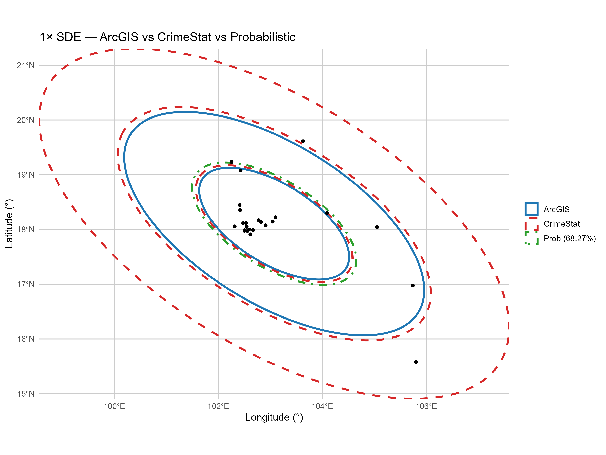
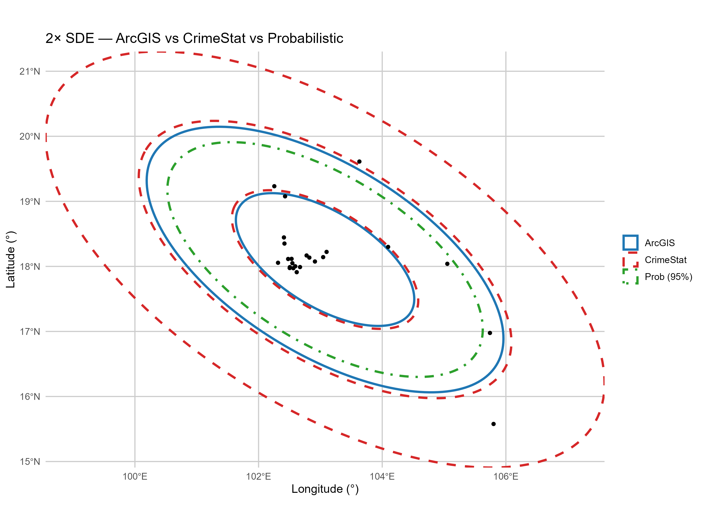
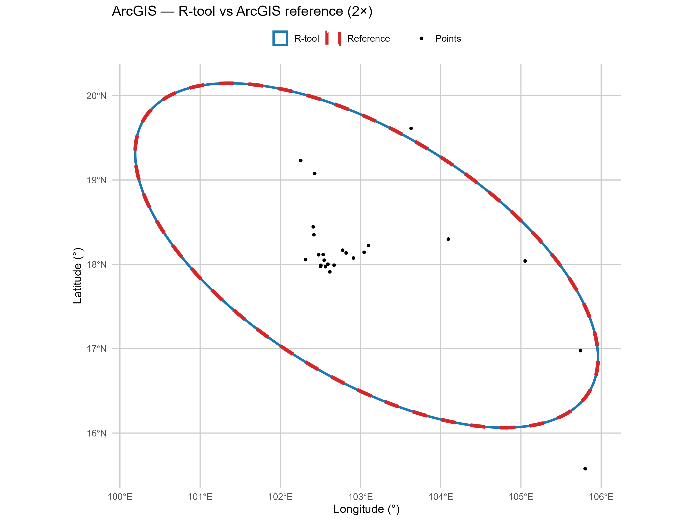
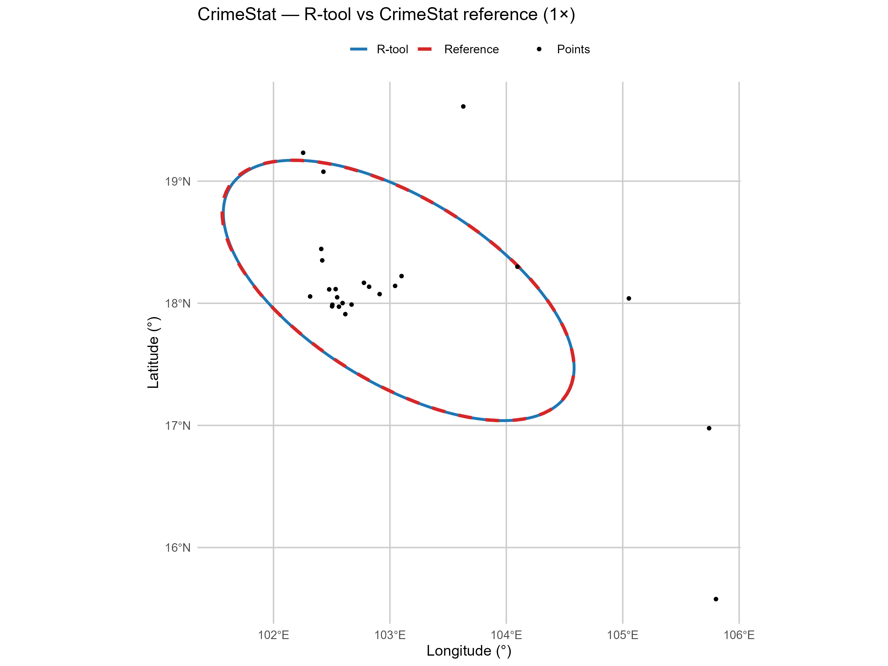
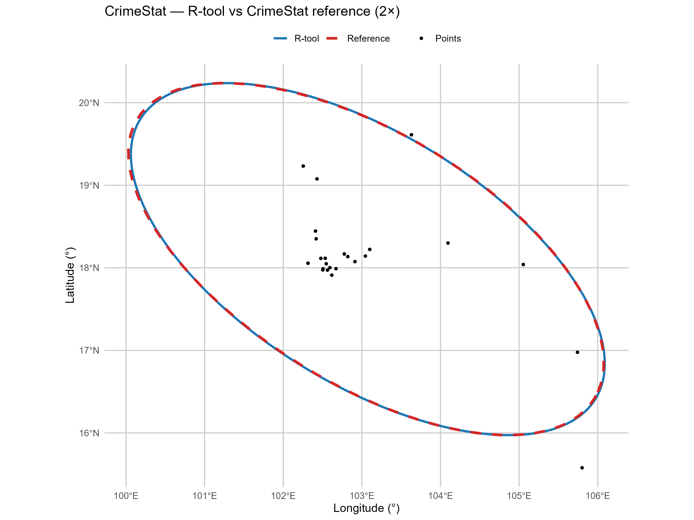
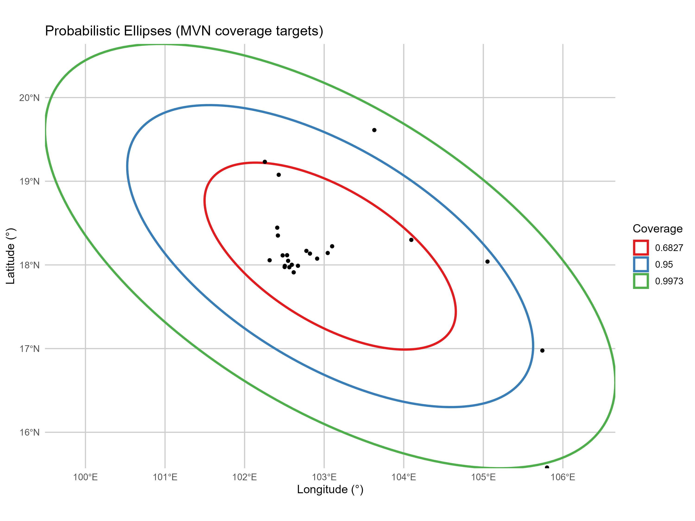

# 🧪 Standard Deviational Ellipse (SDE) Validation

This page validates the **R-based SDEtool** against **ArcGIS** and **CrimeStat** using the same dataset (**Lepto**, *n = 24*, WGS84). We report geometric overlap (IoU), angles, centers, and % point coverage. All angles reported here use **clockwise-from-north** (`north_cw`) to match ArcGIS/CrimeStat UI.

---

## 🔍 Summary of Results

### ArcGIS preset (R) vs ArcGIS shapefiles (1×, 2×)

| Metric | 1 SD | 2 SD |
|---|---:|---:|
| **IoU (overlap)** | **0.999873** | **0.999873** |
| **Angle Δ (north_cw)** | **0.00027°** | **0.00027°** |
| **Centroid distance** | ≈ **9×10⁻⁶°** (≈ **1 m**) | ≈ **9×10⁻⁶°** (≈ **1 m**) |
| **% points inside (unweighted)** | **75.0000%** | **91.6667%** |
| **Major axis Δ (%)** | **−0.00002%** | **−0.00002%** |
| **Minor axis Δ (%)** | **−0.00074%** | **−0.00074%** |

> **Config:** `mode="arcgis"`, `df = n`, `scale = k·√2`, `angle = north_cw`, computed **in WGS84 degrees**.

---

### CrimeStat preset (R) vs CrimeStat shapefiles (1×, 2×)

| Metric | 1 SD | 2 SD |
|---|---:|---:|
| **IoU (overlap)** | **0.996356** | **0.993754** |
| **Angle Δ (north_cw)** | **0.062°** | **0.069°** |
| **Centroid distance** | **0.003182°** (≈ **0.35 km**) | **0.012736°** (≈ **1.4 km**) |
| **% points inside (unweighted)** | **79.1667%** | **91.6667%** |

> **Config:** `mode="crimestat"`, `df = n−2`, `scale = k·√2`, `angle = north_cw`.  
> Geometry parity with CrimeStat’s shapefiles is best when computed **in degrees**.  
> **Meters parity** (SDs/areas) is best in a projected CRS (UTM); remaining diffs are within **~0.03–0.3%**.

---

## 🖼️ Visual Evidence

The panels below use the exact figures generated from the validation runs. Points are shown in black. All figures are in **WGS84 (EPSG:4326)** and framed to the combined extent of ellipses and points.

### R-only comparison (ArcGIS preset vs CrimeStat preset vs Probabilistic)
*These show our three internal approaches on the same points.*

  
**Figure A.** 1× SDE comparison. ArcGIS preset (blue), CrimeStat preset (red dashed), Probabilistic 68.27% (green dot-dash). All of these are generated by the R SDEtool.

  
**Figure B.** 2× SDE comparison. ArcGIS preset (blue), CrimeStat preset (red dashed), Probabilistic 95% (green dot-dash). All of these are generated by the R SDEtool.

### R-tool (ArcGIS preset in SDEtool) vs ArcGIS shapefiles
*Demonstrates byte-level agreement in degrees.*

  
**Figure C.** 1×: R-tool (blue solid) vs ArcGIS reference (red dashed). IoU ≈ 0.9999.

  
**Figure D.** 2×: R-tool (blue solid) vs ArcGIS reference (red dashed). IoU ≈ 0.9999.

### R-tool (CrimeStat preset in SDEtool) vs CrimeStat shapefiles
*Close geometric agreement in degrees; small residual differences expected.*

  
**Figure E.** 1×: R-tool (blue solid) vs CrimeStat reference (red dashed). IoU ≈ 0.996.

  
**Figure F.** 2×: R-tool (blue solid) vs CrimeStat reference (red dashed). IoU ≈ 0.994.

### Probabilistic coverage targets (MVN)
*Inference-oriented option that targets coverage \(p\) under a bivariate normal assumption.*

  
**Figure G.** Target coverages 68.27%, 95%, 99.73%. In a single dataset, empirical % inside varies around the targets; across repeated MVN samples, long-run coverage tends to the targets.

---

## 📐 Methodology Notes

- **Angle basis:** `north_cw`. Convert to conventional math angle `east_ccw` via `east_ccw = (90 − north_cw) mod 360`.
- **Containment:** Points on the boundary count as inside.
- **Shapefile DBF fields:** Names may truncate (e.g., `sd_level` → `sd_levl`).
- **CRS:** ArcGIS files include a WGS84 `.prj`; CrimeStat output required assigning **EPSG:4326** during plotting.

**Presets implemented in SDEtool**

| Mode        | df used | Scale | Angle basis | Typical use |
|-------------|---------|-------|-------------|-------------|
| `arcgis`    | `n`     | `k·√2` | `north_cw`  | Match ArcGIS (byte-match) |
| `crimestat` | `n−2`   | `k·√2` | `north_cw`  | Match CrimeStat |
| `prob`      | `n−1`   | `√(qchisq(p, df=2))` | `east_ccw` (convert/report as needed) | Target exact coverage \(p\) |

---

## ✅ Takeaways

- **ArcGIS parity** is effectively exact when computed **in degrees** with `df=n`, `k·√2`, `north_cw`.  
- **CrimeStat parity** in degrees is **very close**; meter SDs/areas match CrimeStat’s text within **~0.03–0.3%** when computed in a projected CRS.  
- A **probabilistic** mode is available to target exact coverages under MVN assumptions, included here for transparency.
