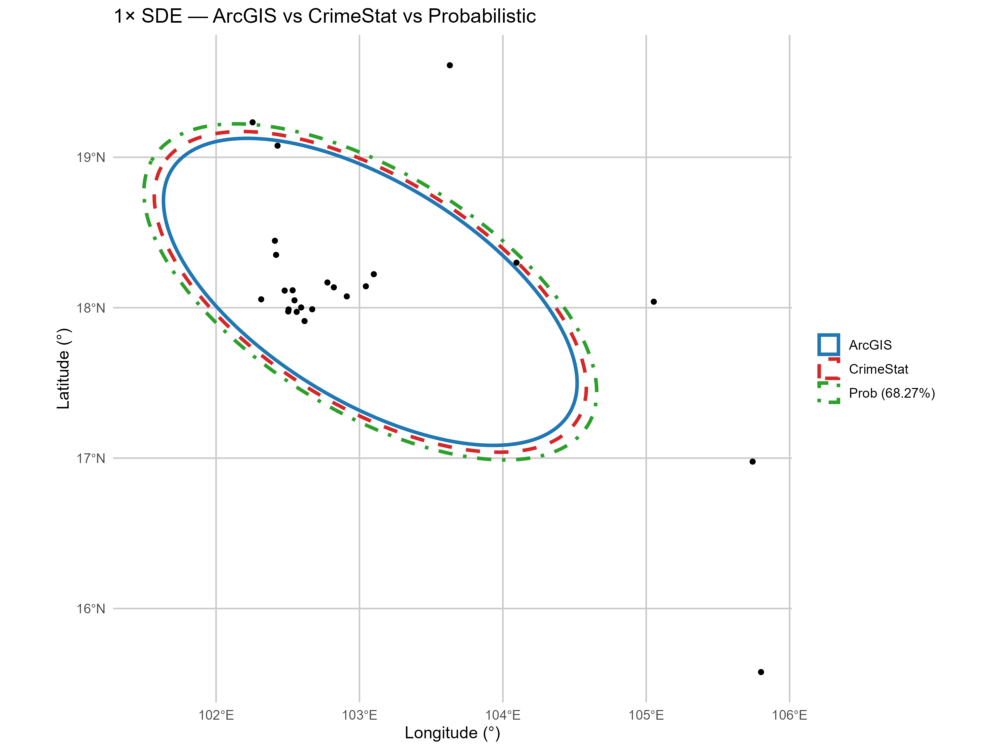
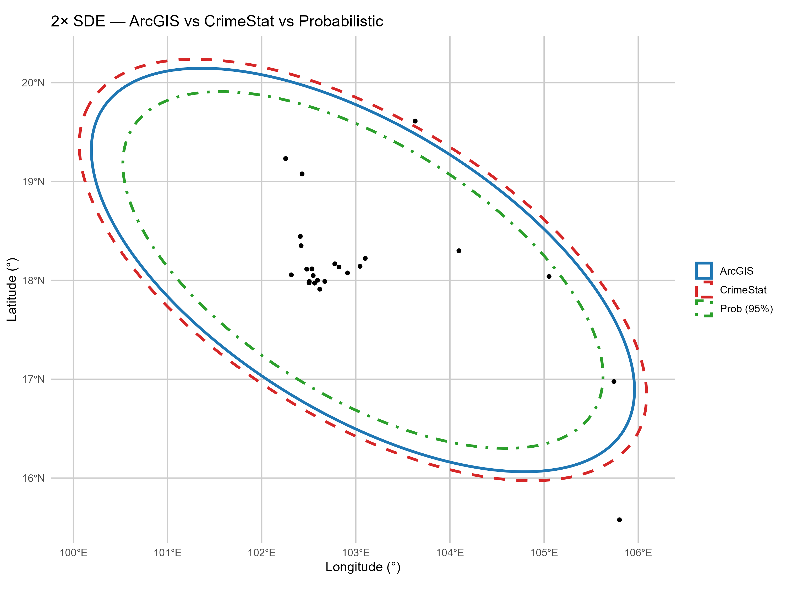
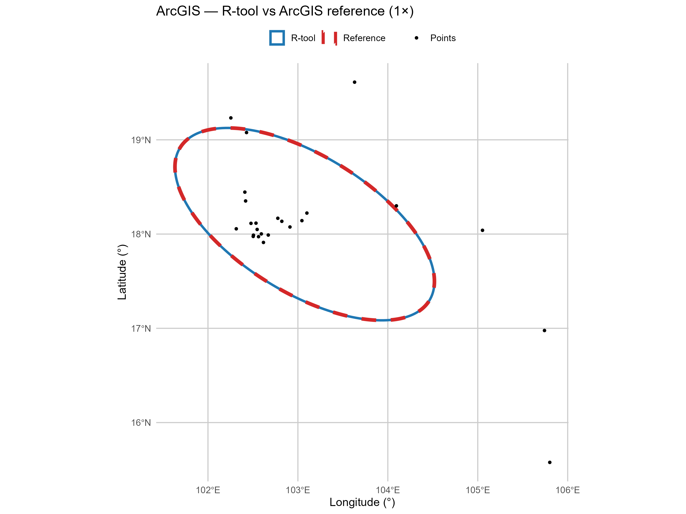
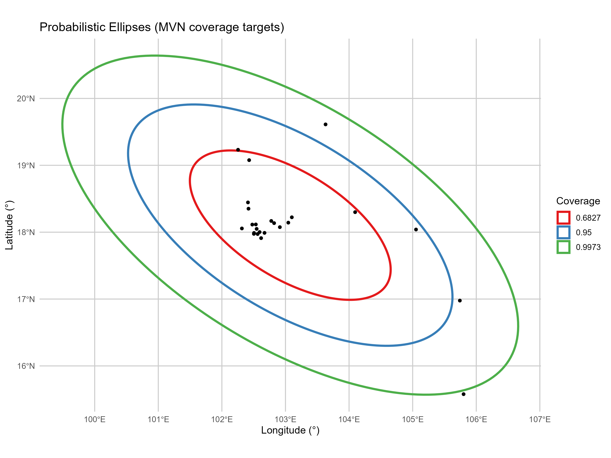

# 🧪 Standard Deviational Ellipse (SDE) Validation

This page compares the **R-based SDEtool** against **ArcGIS** and **CrimeStat** using the same dataset (**Lepto**, *n = 24*, WGS84). We report geometric overlap (IoU), angles, centers, and % point coverage. All angles reported in the tables use **clockwise-from-north** (`north_cw`) to align with ArcGIS/CrimeStat UIs.

> **How to read this page**
> - Each summary table below compares **SDEtool (specific preset)** against the **named desktop tool** for **1× SD** and **2× SD** ellipses.  
> - SDEtool can also produce **3× SD** (not shown in tables; see figures if needed).  
> - Figures are displayed at a smaller width for readability; open in a new tab to view full resolution.

---

## 🔍 Summary of Results

### ArcGIS preset (using SDEtool in R) vs ArcGIS shapefiles (1×, 2×)
*This table compares SDEtool’s `mode="arcgis"` output to ArcGIS output on the same points, for 1× and 2× SD ellipses.*

| Metric | 1 SD | 2 SD |
|---|---:|---:|
| **IoU (overlap)** | **0.999873** | **0.999873** |
| **Angle Δ (north_cw)** | **0.00027°** | **0.00027°** |
| **Centroid distance** | ≈ **9×10⁻⁶°** (≈ **1 m**) | ≈ **9×10⁻⁶°** (≈ **1 m**) |
| **% points inside (unweighted)** | **75.0000%** | **91.6667%** |
| **Major axis Δ (%)** | **−0.00002%** | **−0.00002%** |
| **Minor axis Δ (%)** | **−0.00074%** | **−0.00074%** |

> **Config:** `mode="arcgis"`, `df = n`, `scale = k·√2`, `angle = north_cw`, computed **in WGS84 degrees**.

---

### CrimeStat preset (using SDEtool in R) vs CrimeStat shapefiles (1×, 2×)
*This table compares SDEtool’s `mode="crimestat"` output to CrimeStat output on the same points, for 1× and 2× SD ellipses.*

| Metric | 1 SD | 2 SD |
|---|---:|---:|
| **IoU (overlap)** | **0.996356** | **0.993754** |
| **Angle Δ (north_cw)** | **0.062°** | **0.069°** |
| **Centroid distance** | **0.003182°** (≈ **0.35 km**) | **0.012736°** (≈ **1.4 km**) |
| **% points inside (unweighted)** | **79.1667%** | **91.6667%** |

> **Config:** `mode="crimestat"`, `df = n−2`, `scale = k·√2`, `angle = north_cw`.  
> Geometry parity with CrimeStat’s shapefiles is best when computed **in degrees**.  
> **Meters parity** (SDs/areas) is best in a projected CRS (UTM); remaining diffs are within **~0.03–0.3%**.

---

## 🖼️ Visual Evidence

Points are black. All figures are in **WGS84 (EPSG:4326)** and framed to the combined extent of ellipses and points. (Images are intentionally smaller here for readability.)

### R-only comparison (ArcGIS preset vs CrimeStat preset vs Probabilistic)
*All three approaches are generated by SDEtool on the same points.*

<table>
  <tr>
    <td></td>
    <td></td>
  </tr>
  <tr>
    <td align="center"><b>Figure A.</b> 1× SDE comparison. ArcGIS preset (blue), CrimeStat preset (red dashed), Probabilistic 68.27% (green dot-dash).</td>
    <td align="center"><b>Figure B.</b> 2× SDE comparison. ArcGIS preset (blue), CrimeStat preset (red dashed), Probabilistic 95% (green dot-dash).</td>
  </tr>
</table>

### R-tool (ArcGIS preset in SDEtool) vs ArcGIS shapefiles
*Demonstrates byte-level agreement in degrees.*

<table>
  <tr>
    <td></td>
    <td></td>
  </tr>
  <tr>
    <td align="center"><b>Figure C.</b> 1×: R-tool (blue solid) vs ArcGIS reference (red dashed). IoU ≈ 0.9999.</td>
    <td align="center"><b>Figure D.</b> 2×: R-tool (blue solid) vs ArcGIS reference (red dashed). IoU ≈ 0.9999.</td>
  </tr>
</table>

### R-tool (CrimeStat preset in SDEtool) vs CrimeStat shapefiles
*Close geometric agreement in degrees; small residual differences expected.*

<table>
  <tr>
    <td></td>
    <td></td>
  </tr>
  <tr>
    <td align="center"><b>Figure E.</b> 1×: R-tool (blue solid) vs CrimeStat reference (red dashed). IoU ≈ 0.996.</td>
    <td align="center"><b>Figure F.</b> 2×: R-tool (blue solid) vs CrimeStat reference (red dashed). IoU ≈ 0.994.</td>
  </tr>
</table>

### Probabilistic coverage targets (MVN)
*Inference-oriented option that targets coverage \(p\) under a bivariate normal assumption.*

  
**Figure G.** Target coverages 68.27%, 95%, 99.73%. In a single dataset, empirical % inside varies around the targets; across repeated MVN samples, long-run coverage tends to the targets.

---

## 📐 Methodology Notes (expanded)

**Data & tools**
- **Dataset:** Lepto points (*n = 24*), geographic coordinates in **WGS84 (EPSG:4326)**.
- **Comparators:** Desktop **ArcGIS** and **CrimeStat** shapefile outputs generated from the same points.
- **R tool:** SDEtool with presets `mode="arcgis"` and `mode="crimestat"`; optional `mode="prob"` for coverage-target ellipses.

**Computation domain (CRS)**
- **Parity in degrees:** For geometry parity with ArcGIS/CrimeStat shapefiles, SDEtool computes **in the input CRS (degrees)** with `compute_in="input"` and reports in `output_crs="input"`.
- **Metric parity:** For parity on **axis lengths/areas in meters**, compute in a **projected CRS** (e.g., UTM). SDEtool supports `compute_in="working"` with `working_crs="auto_utm"` (or a specific EPSG) and `output_crs` switch to return either working CRS or back to input CRS.

**Angle conventions**
- **Reporting convention:** Tables report **`north_cw`** (clockwise from geographic north) to match ArcGIS/CrimeStat UIs.
- **Math convention:** Internal eigenvector orientations are naturally **`east_ccw`** (mathematical). Conversion used in reporting:
  \[
  \text{east\_ccw} = (90^\circ - \text{north\_cw}) \bmod 360
  \]
- SDEtool outputs both `orientation_deg` (east_ccw) and `angle_north_cw`; `angle_basis` records which convention the preset uses/returns.

**Degrees of freedom & scaling by preset**
- **ArcGIS preset:** `df = n`, scale = \(k \cdot \sqrt{2}\), angle basis `north_cw`.
- **CrimeStat preset:** `df = n - 2`, scale = \(k \cdot \sqrt{2}\), angle basis `north_cw`.
- **Probabilistic preset:** `df = n - 1`, scale = \(\sqrt{\chi^2_{2}(p)}\) to target coverage \(p\) under bivariate normality; orientations in `east_ccw` internally, converted for reporting as needed.

**Ellipse center, axes, and area**
- **Center:** Sample mean of \(x, y\) in the computation CRS (weighted or unweighted, depending on inputs).
- **Axes & orientation:** From eigen-decomposition of the covariance (or weighted scatter) matrix; major/minor axis lengths scale by the preset’s factor.
- **Area:** \(\pi \times a \times b\) in the computation CRS; areas in meters require projected CRS.

**Containment rule**
- A point **on the boundary** is counted as **inside** an ellipse.

**Metrics reported**
- **IoU (Intersection-over-Union):** \(\text{IoU} = \frac{\text{Area}(\mathcal{E}_1 \cap \mathcal{E}_2)}{\text{Area}(\mathcal{E}_1 \cup \mathcal{E}_2)}\), computed on planar geometries in the comparison CRS with `st_make_valid()` safeguards.
- **Angle Δ:** Absolute difference in reported orientations (in **`north_cw`** degrees for tables).
- **Centroid distance:** Great-circle approximated by converting degree deltas to meters (≈111 km per degree) for readability.
- **% inside:** Fraction of points inside each ellipse under the **containment** rule above.
- **Axis deltas (%):** Relative difference in major/minor axis lengths between SDEtool and the reference output.

**Files, attributes, and shapefile limits**
- **CRS tags:** ArcGIS shapefiles include a WGS84 `.prj`; CrimeStat outputs required assigning **EPSG:4326** during plotting.
- **Attribute names:** Shapefile DBF fields are limited to **≤10 characters** and may truncate (e.g., `sd_level → sd_levl`). SDEtool keeps long names in R objects and maps to DBF-safe names on export.

---

## ✅ Takeaways

- **ArcGIS parity** is effectively exact when computed **in degrees** with `df = n`, `k·√2`, `north_cw`.  
- **CrimeStat parity** in degrees is **very close**; meter SDs/areas match CrimeStat text within **~0.03–0.3%** when computed in a projected CRS.  
- A **probabilistic** mode is available to target exact coverages under MVN assumptions; included here for transparency alongside parity checks.
